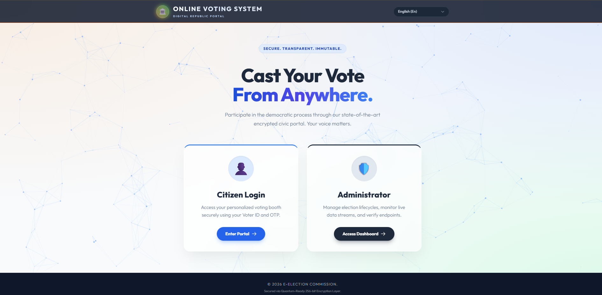
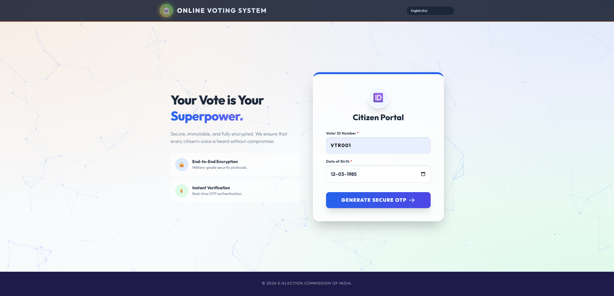
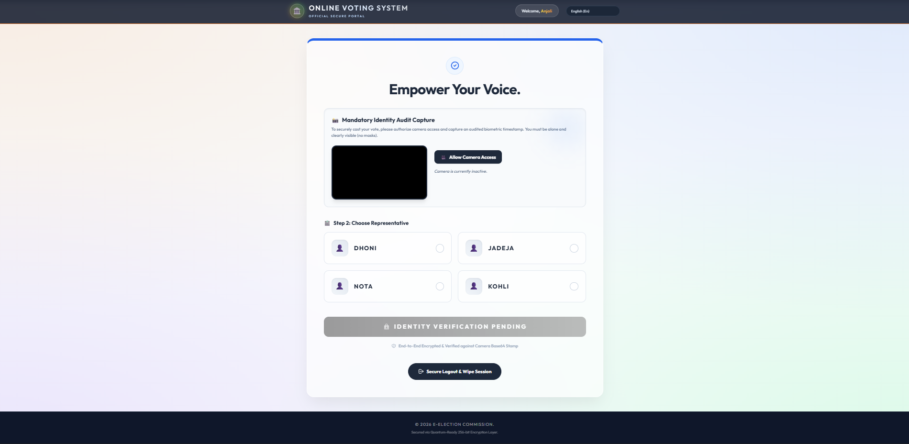
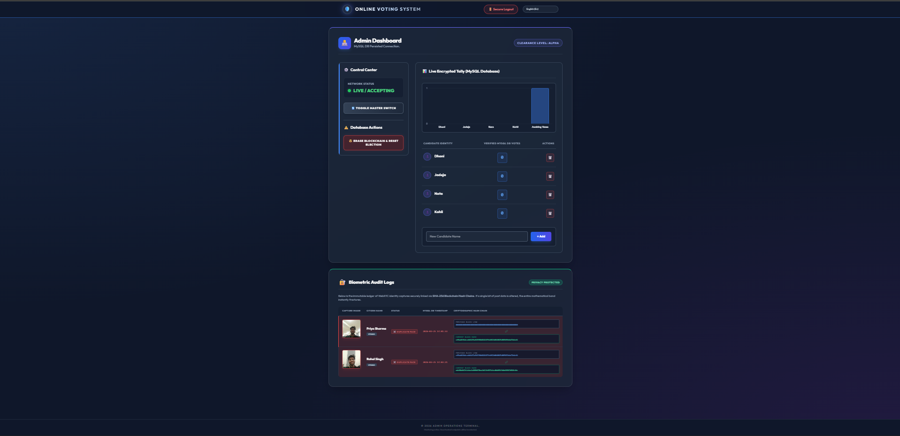

# 🗳️ Online Voting System

A secure and user-friendly online voting system built using **Spring Boot** and **Java**. This application allows voters to cast their votes digitally while enabling administrators to manage elections efficiently.

---

## 🚀 Features
- 🔐 Voter login with authentication  
- 🗳️ Secure voting process  
- 👨‍💻 Admin dashboard  
- 📋 Candidate management  
- 📊 Result display  

---

## 🛠️ Tech Stack
- **Backend:** Java, Spring Boot  
- **Frontend:** Thymeleaf, HTML, CSS  
- **Database:** MySQL  
- **Build Tool:** Maven  

---

## 📸 Screenshots

### 🏠 Home Page


### 🔐 Login Page


### 🗳️ Voting Page


### 📊 Results Page


---

## ⚙️ How to Run

### 1. Clone the Repository
```bash
git clone https://github.com/penumachha-poojithvarmasai/OnlineVotingSystem.git
```

### 2. Navigate to Project Folder
```bash
cd OnlineVotingSystem
```

### 3. Configure Database

Update `application.properties`:

```properties
spring.datasource.url=jdbc:mysql://localhost:3306/voting_db?createDatabaseIfNotExist=true
spring.datasource.username=root
spring.datasource.password=your_password
```

### 4. Run the Application
```bash
mvn spring-boot:run
```

### 5. Open in Browser
```
http://localhost:8080
```

---

## 🎯 Objective
To provide a secure, efficient, and transparent online voting solution.

---

## 👤 Author
**Poojith Varma Sai**
